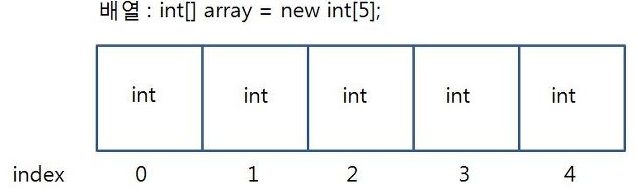

# 배열(Array)

`2023-07-12`

**배열**(Array)은 같은 타입의 데이터를 여러개 나열한 **선형 자료구조**이다. <br>
배열을 구성하는 각각의 값을 `요소(element)`라고 하며, 배열에서 위치를 가리키는 숫자는 `인덱스(index)`라고 한다.

> 배열은 메모리 공간에 **순차적으로 데이터를 저장**하고, 선언할 때 크기를 정하면 그 크기로 **고정**된다. <br>
> 선언된 값은 다시 배열을 선언하지 않으면 **변경할 수 없다.**
> 대부분의 프로그램 언어에서 동일 타입의 데이터를 저장하며<br>
> 배열이 `int`타입이라면 정수 요소만 저장할 수 있으며, `double, float, char`등과 같은 다른 타입의 요소는 저장할 수 없다.
>  <br>
> 이미지 출처 : https://velog.io/@hanif/%EC%9E%90%EB%A3%8C%EA%B5%AC%EC%A1%B0-%EB%B0%B0%EC%97%B4

---

<br>

# 배열 표현

```C
int arr [10] = {32,10,9,10,40,35,25,16,28,30}
```

위의 코드는 C언어로 배열을 선언한 것이다.

- Type : int
- Name : arr
- Size : [10]
- Elements : {32,10,9,10,40,35,25,16,28,30}
  > 위의 내용에서 알 수 있는 것. <br>
  >
  > - 연속된 메모리 공간에 데이터들이 순차적으로 저장되어있다.
  > - C에서 인덱스는 0부터 시작한다.
  > - 배열의 크기는 10이므로 10개의 요소(element)를 저장할 수 있다.
  > - 각 요소(element)는 인덱스(index)를 통해 액세스 할 수 있다.

---

<br>

# 배열의 시간 복잡도(Time complexity)

| Operation | Average Case | Worst Case |
| --------- | :----------: | :--------: |
| Read      |     O(1)     |    O(1)    |
| Insert    |     O(n)     |    O(n)    |
| Delete    |     O(n)     |    O(n)    |
| Search    |     O(n)     |    O(n)    |

1 **읽기**(Read)

- 배열에서 특정 인덱스에 접근하여 값을 읽는 경우 시간 복잡도는 O(1)이다.
  > 인덱스를 알고 있기 때문에 직접 접근할 수 있기 때문이다.

2 **삽입**(Insert)

- 배열에서 값을 삽입하는 경우, 삽입하려는 위치가 배열의 끝에 가까울수록 시간 복잡도는 O(1)에 가깝다.
  > 빈 공간이 남아 있어 바로 삽입이 가능하기 때문이다.
- 배열의 중간에 삽입하는 경우, 해당 위치 이후의 모든 요소를 오른쪽으로 이동시켜야 하기 때문에 시간 복잡도는 O(n)이다.
  > 배열의 크기에 비례하여 선형적으로 증가한다.

3 **삭제**(Delete)

- 배열에서 값을 삭제하는 경우, 삭제하려는 위치가 배열의 끝에 가까울수록 시간 복잡도는 O(1)에 가깝다.
  > 삭제 후 빈 공간이 생기기 때문에 바로 처리할 수 있기 때문이다.
- 배열의 중간에서 값을 삭제하는 경우, 삭제한 위치 이후 모든 요소를 왼쪽으로 이동시켜야 하기에 시간 복잡도는 O(n)이다.
  > 배열의 크기에 비례하여 선형적으로 증가한다.

4 **검색**(Search)

- 배열에서 값을 검색하는 경우, 최악의 경우 모든 요소를 확인해야 하므로 시간 복잡도는 O(n)이다.
  > 배열의 크기에 비례하여 선형적으로 증가한다.

---

<br>

# 배열의 특징

- 동일한 데이터 유형을 가진다.

  > 주로 동일한 데이터 유형을 가지지만 이질형 데이터도 지원 가능한 프로그래밍 언어가 있다. <br>
  >
  > > 이질형 데이터들이 모인 집합체는 주로 레코드라고 한다.

- 배열의 각 요소에 접근하는 시간은 O(1)로 모두 동일하다.

  > 기본위치 + 오프셋(요소크기 \* 인덱스) 연산으로 모든 요소에 접근 가능하다.

- 연속된 메모리에 단일 블록화하여 데이터를 저장한다.

  > 낭비되는 공간이 거의 없다.
  > 큰 배열일 경우에 필요 메모리 할당이 불가능할 수도 있다.

- 실제 메모리 상에서 데이터가 순차적으로 저장되기 때문에 순서가 있다.

  > index가 존재하여 indexing 및 slicing이 가능하다.
  >
  > > indexing : index를 사용해 특정 요소(element)를 리스트로 부터 읽어드리는 것. <br>
  > > slicing : 요소(element)에 특정 부분을 따로 분리해 조작하는 것.

---

<br>

# 배열의 장단점

## 장점

- 인덱스를 통한 검색.

  > 인덱스를 이용한 접근이 가능하기 때문에 모든 요소에 빠르게 접근 가능하다.

- 연속적인 메모리 관리.
  > 기록 밀도가 1이기 때문에 공간 낭비가 적다. (부가정보 없이 데이터만 저장하기 때문이다.)

## 단점

- 정적이므로 배열의 크기를 컴파일 이전에 정해주어야 한다.

- 한 데이터를 삭제하더라도, 배열은 연속해야하므로 공간이 남는다.
  > 중간에 특정 요소를 삽입 및 삭제하는 경우 항상 메모리가 순차적으로 이어져야 하기 때문에 메모리가 낭비된다.

---

<br>

# 배열을 사용하는 경우

- 순차적인 데이터를 저장하고 값보다 순서가 중요할 때.

- 다차원 데이터를 다룰 때.

- 특정 요소를 빠르게 읽어야 할 때.

- 데이터의 사이즈가 자주 바뀌지 않고, 요소가 자주 추가되거나 삭제되지 않을 때.

---

> 도움 받은 페이지 : https://yoongrammer.tistory.com/43
