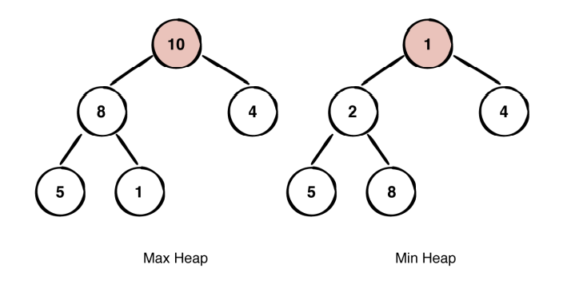

# 힙 정렬(Heap Sort)

2023-07-06

**힙**(Heap)은 최댓값 및 최솟값을 찾아내는 연산을 빠르게 하기 위해 고안된 완전 이진트리를 기본으로 한 자료구조이다. - 위키백과

> 최댓값과 최솟값을 찾는데 최적화 되어있는 이유는 Heap 특성상 최대 힙일 때 가장 큰 값이 루트 노드로 오고, 최소 힙일 때는 가장 작은 값이 루트 노드로 오기 때문이다.

---

<br>

# 힙의 종류

힙에는 두가지의 종류가있다. <br>


<br> 이미지 출처 : https://underdog11.tistory.com/entry/%EC%95%8C%EA%B3%A0%EB%A6%AC%EC%A6%98-Heap

- **최대힙(Maxheap)** : 높은 값을 가진 element가 우선순위 위에 있다.

  > 부모 노드의 키 값이 자식 노드의 키 값보다 크거나 같다.

- **최소힙(Minheap)** : 낮은 값을 가진 element가 우선순위 위에 있다.
  > 부모 노드의 키 값이 자식 노드의 키 값보다 작거나 같다.

---

<br>

# 힙 정렬 과정

`최대 힙을 예시로 함` <br>
1 먼저 이진 탐색트리를 만들며 최대 힙을 구현한다.

2 그 후 최대 힙의 최대 루트 노드를 배열의 마지막 자리 원소로 고정하고 트리에서 마지막 노드와 자리를 바꾼다.

3 이 과정을 모든 자리가 고정 될 때까지 최대 힙을 만들고 루트 노드를 배열의 마지막 원소로 만드는 과정을 반복하여 정렬을 수행한다.

---

구현 코드

```C++
// c++ 로 구현한 힙 정렬
#include <iostream>

using namespace std;

// i 노드가 가장 큰 노드인 힙트리를 만들기 위한 함수
// 힙 사이즈는 n
void heapify(int arr[], int n, int i)
{
    int largest = i; // 루트를 가장 큰 노드로 초기 설정
    int l = 2 * i + 1; // left
    int r = 2 * i + 2; // right

    // 왼쪽 자식 노드가 가장 큰 노드보다 클 때
    if (l < n && arr[l] > arr[largest])
        largest = l;

    // 오른쪽 자식 노드가 가장 큰 노드보다 클때
    if (r < n && arr[r] > arr[largest])
        largest = r;

    // 만약, 가장 큰 노드가 루트가 아니면 스왑
    if (largest != i) {
        swap(arr[i], arr[largest]);

        // 재귀적으로 서브트리를 힙화 한다.
        heapify(arr, n, largest);
    }
}

// 힙 정렬 함수
void heapSort(int arr[], int n)
{
    // 힙을 구성 (배열 재 정렬)
    for (int i = n / 2 - 1; i >= 0; i--)
        heapify(arr, n, i);

    // 하나씩 힙에서 원소를 추출
    for (int i = n - 1; i > 0; i--) {
        // 루트노드를 끝 노드로 이동
        swap(arr[0], arr[i]);

        // 줄어든 힙에서 최대 힙 구성
        heapify(arr, i, 0);
    }
}

// n 크기의 배열을 출력하는 코드
void printArray(int arr[], int n) {
    for (int i = 0; i < n; ++i)
        cout << arr[i] << " ";
    cout << "\n";
}

int main() {
    int arr[] = { 12, 11, 13, 5, 6, 7 };
    int n = sizeof(arr) / sizeof(arr[0]);

    heapSort(arr, n);

    cout << "정렬된 배열은 : \n";
    printArray(arr, n);
}
// 코드 출처 : https://hongcoding.tistory.com/186
```
