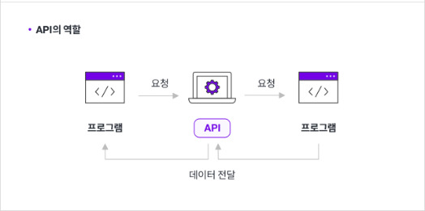

# API

2023-07-03

이미지 출처 : https://velog.io/@qowhdgn/%EB%84%A4%ED%8A%B8%EC%9B%8C%ED%81%AC-API%EB%9E%80

> **API**(Application Programming Interface)는 응용 프로그램에서 사용할 수 있도록, 운영 체제나 프로그래밍 언어가 제공하는 기능을 제어할 수 있게 만든 인터페이스를 뜻한다. -위키백과
>
> > API는 정의 및 프로토콜 집합을 사용하여 두 소프트웨어 구성 요소가 서로 통신할 수 있게 하는 메커니즘이다. - aws

---

 

# API의 작동원리

 
이미지 출처 : https://brunch.co.kr/@ahnjiwoo/26

`클라이언트 요청(Request)` -> `서버는 데이터 제공(Response)`

> 데이터의 형태는 HTML, XML, json 등으로 다양하다.

---

 

# API의 종류

## 1. **Private** API

- 내부 API로, 기업이나 연구 단체 등에서 자체 제품과 운영 개선을 위해 단체 내부에서만 사용한다.

## 2. **Public** API

- 개방형 API로, 모두에게 공개되며 Public API 중에서도 접속하는 대상에 대한 제약이 없는 경우를 **Open API**라고 한다.
  > 오픈 API 사이트 예시:
  >
  > > 구글 : https://cloud.google.com/apis?hl=ko  
  > > 공공데이터포털- https://www.data.go.kr/  
  > > 문화데이터 광장 – https://www.culture.go.kr/data/main/main.do  
  > > 카카오 : https://developers.kakao.com/tool

## 3. **Partner** API

- 특정 비즈니스 파트너 간의 데이터 공유하며, 동의하는 특정인들만 사용할 수 있다.

 

# 아키텍처 스타일에 따른 API 종류

1 **SOAP**(Simple Object Access Protocol) API

- XML 메시지 형식을 사용하며 HTTP 또는 SMTP를 통해 요청을 수신합니다.
