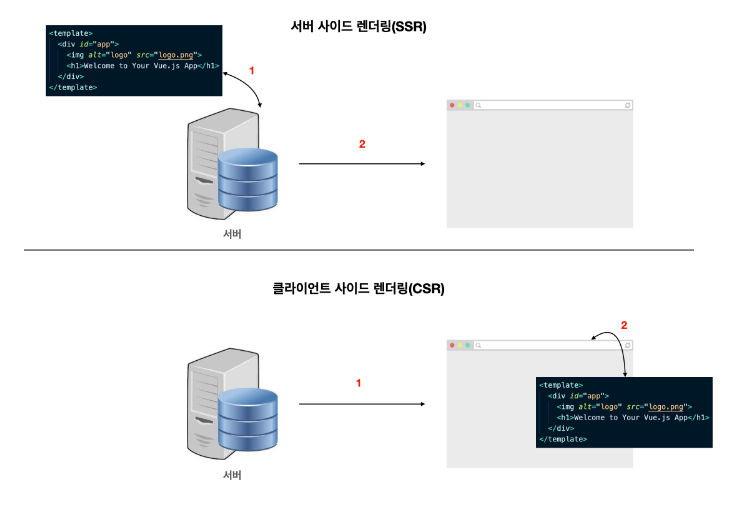

# CSR & SSR

`2023-07-19`

   이미지 출처 : https://velog.io/@wkfwktka/%EC%84%9C%EB%B2%84-%EC%82%AC%EC%9D%B4%EB%93%9C-%EB%A0%8C%EB%8D%94%EB%A7%81SSR%EA%B3%BC-%ED%81%B4%EB%9D%BC%EC%9D%B4%EC%96%B8%ED%8A%B8-%EC%82%AC%EC%9D%B4%EB%93%9C-%EB%A0%8C%EB%8D%94%EB%A7%81CSR  

## CSR과 SSR의 차이점

- CSR은 페이지의 내용을 브라우저에서 SSR은 서버에서 페이지의 내용을 다 그려서 브라우저로 던져준다.
- SSR의 경우 브라우저에 대한 응답은 렌더링 준비가 된 HTML 페이지인 반면에 CSR의 경우 JS에 대한 링크가 있는 빈 문서를 제공한다.

## CSR

**클라이언트 사이드 렌더링**(Client-Side Rendering, CSR)은 웹 애플리케이션에서 사용되는 렌더링 방식 중 하나이며,  
기본적으로 서버로부터 전달받은 데이터를 클라이언트(웹 브라우저)에서 동적으로 가공하여 화면에 표시하는 방식이다.

> 대표적인 싱글 페이지 애플리케이션과 함께 주로 사용된다.
>
> > `React, Angular, Vue.js`등의 프론트엔드 프레임워크와 라이브러리에서 지원한다.

## SSR

**서버 사이드 렌더링**(Server-Side Rendering, SSR)은 웹 애플리케이션에서 사용되는 렌더링 방식중 하나이며, 
서버에서 초기 HTML을 생성하고 클라이언트에게 전달하여 웹 페이지를 렌더링 하는 방식이다.

> 전통적인 다중 페이지 애플리케이션에서 주로 사용된다
>
> > `Next.js, Nuxt.js`등이 대표적이다.

---

 

# CSR & SSR의 동작 방식

## CSR

1. 사용자가 웹 페이지를 접속.
2. 서버는 초기 HTML, CSS 및 JS 파일을 클라이언트에게 전송.
3. 클라이언트는 초기 HTML을 파싱하여 페이지의 뼈대를 제작.
4. 클라이언트는 초기 페이지 로드 후 플요한 데이터를 서버로부터 비동기적으로 요청.
   > 이 데이터는 주로 API 호출을 통해 가져옴.
5. 데이터가 도착하면 클라이언트는 JS를 사용하여 데이터를 가공하고 화면에 동적으로 적용.
6. 클라이언트는 가공된 데이터를 사용하여 웹 페이지를 업데이트하고 사용자와 상호작용함.

## SSR

1. 사용자가 웹 페이지에 접속.
2. 서버는 초기 HTML, CSS 및 JS파일을 생성.
3. 서버는 필요한 데이터를 가져와 초기 HTML에 데이터를 채움.
4. 서버는 완성된 초기 HTML을 클라이언트에게 전송.
5. 클라이언트는 받은 초기 HTML을 파싱하여 화면에 표시.
6. 클라이언트는 초기 페이지 로드 후 추가적인 데이터나 사용자 상호작용에 따라 서버에 요청을 보내고,  서버는 필요한 데이터만을 응답하여 클라이언트에게 전달.
7. 클라이언트는 받은 데이터를 사용하여 웹 페이지를 업데이트하고 사용자와 상호작용함.

---

 

# 장점과 단점

## CSR의 장점

- 사용자 경험(UX)이 향상된다.
- 서버 부하가 감소한다.
- 웹 애플리케이션과 API의 분리가 가능하다.

## CSR의 단점

- 초기 페이지 로드 속도가 느릴 수 있다.
- 검색 엔진 최적화(SEO)에 문제가 있을 수 있다.
- 클라이언트 측에서 처리되므로 보안에 취약할 수 있다.

## SSR의 장점

- 초기 페이지 로드 속도가 빠르다.
- 검색 엔진 최적화(SEO)에 용이하다.
- 보안이 강화된다.

## SSR의 단점

- 서버에 부하가 많이 걸릴 수 있다.
- 웹 애플리케이션의 복잡성이 증가할 수 있다.
- 사용자 경험(UX)이 초기 로딩 이후에 개선된다.
